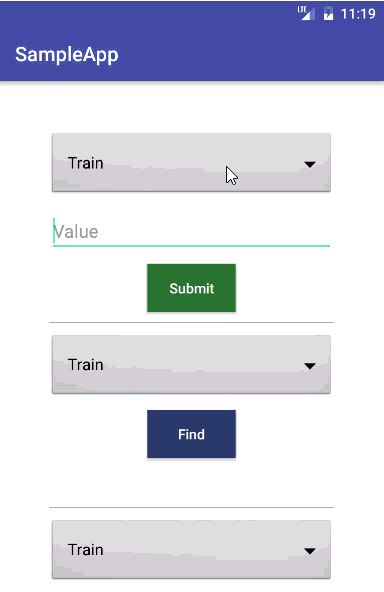

# SharedPreferencesManager

Makes easy to work with Shared Preferences

<div style="border-style: solid; border-width: 1px;">
  
</div>

A useful library containing a helper methods for the shared preferences in Android.

```Java
public class MainActivity extends AppCompatActivity {

    @Override
    public void onCreate() {
        super.onCreate();
	
	//To initialize and set data at the same time!
        SharedPreferencesManager sharedPreferencesManager = 
                new SharedPreferencesManager(this)
                .setValue(SharedPrefKeys.TRAIN.toString(), "MyTrainData")
                .setValue(SharedPrefKeys.BICYCLE.toString(), "MyBicycleData")
                .setValue(SharedPrefKeys.CAR.toString(), "MyCarData");
		
	//To get data
	String data = sharedPreferencesManager.getValue(SharedPrefKeys.BICYCLE.toString(), String.class);
	
	//To delete data
	sharedPreferencesManager.clearData(SharedPrefKeys.BICYCLE.toString());
	
	//To clear all data
	sharedPreferencesManager.clearAll();
    }
}
```


To store keys in an appropriate way, Enum can be used:
````Java
public enum SharedPrefKeys {
    TRAIN(0, "Train"),
    CAR(1, "Car"),
    PLANE(3, "Plane"),
    BICYCLE(4, "Bicycle");

    private int intValue;
    private String stringValue;

    private SharedPrefKeys(int value, String name) {
        this.intValue = value;
        this.stringValue = name;
    }

    public int toInt() {
        return intValue;
    }

    @Override
    public String toString() {
        return stringValue;
    }
    
}
````

## Usage

To store different objects in shared preferences, use same syntax:

````Java
sharedPreferencesManager
	.setValue(SharedPrefKeys.MYOBJECT.toString(), myObject)
	.setValue(SharedPrefKeys.MYOTHEROBJECT.toString(), myOtherObject)`
 ````
 
Retrieving data can be as simple as:

````Java
DataType data = sharedPreferencesManager.getValue(SharedPrefKeys.MYOBJECT.toString(), DataType.class);
OtherDataType data = 
	sharedPreferencesManager.getValue(SharedPrefKeys.MYOTHEROBJECT.toString(), OtherDataType.class);
````
If data does not exist, getValue method will return `null` value.

You can also add list of objects to Shared Preferences with the same way:

````Java
// Creating Array list (String can be replaced by custom class, model)
ArrayList<String> myList = new ArrayList<>();

// Adding values
myList.add("First Strig");
myList.add("Second String");
myList.add("Third String");

// Saving list to the Shared Preferences
sharedPreferencesManager.setValue(SharedPrefKeys.LISTKEY.toString(), myList);

// Getting list from Shared Preferences
ArrayList<String> asda =  sharedPreferencesManager.getValue(SharedPrefKeys.LISTKEY.toString(), ArrayList.class);
````

For detailed usage, check the sampleApp above.

# How to Setup
Step 1. Add it in your root build.gradle at the end of repositories:

	allprojects {
		repositories {
			...
			maven { url 'https://jitpack.io' }
		}
	}
  
Step 2. Add the dependency

	dependencies {
	        compile 'com.github.emiraslan:SharedPreferencesManager:v1.0.1'
	}
